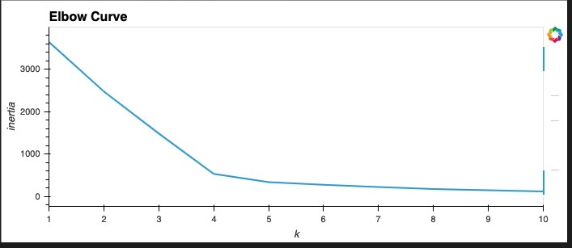
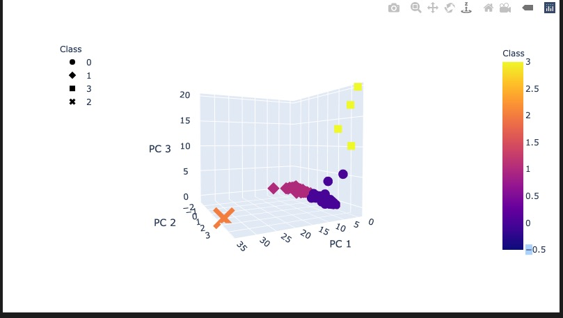
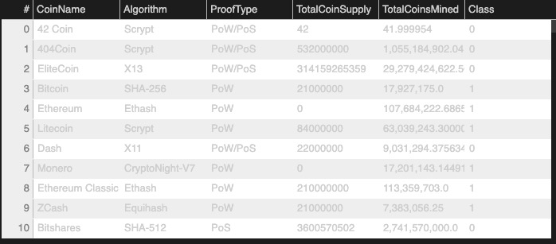
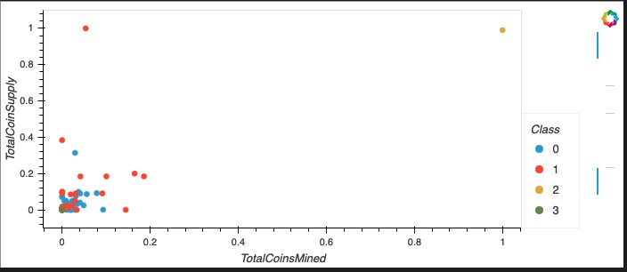

# Cryptocurrencies

## Overview
- The purpose of this project is to use unsupervised machine learning to analyze a database of cryptocurrencies.
- There are four steps:
    - Preprocessing the Data for PCA
    - Reducing Data Dimensions Using PCA
    - Clustering Cryptocurrencies Using K-means
    - Visulizing Cryptocurrencies Results

## Results

- Elbow Curve

- 3D-Scatter with the PCA data and the clusters

- Table with tradable cryptocurrencies

- 2D-Scatter plot with TotalCoinMined vs TotalCoinSupply

